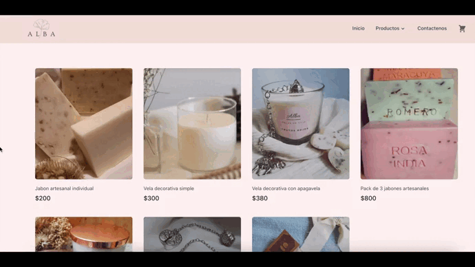

# Alba, tienda de luces - Scented candles e-commerce app
---

Alba is a React SPA app to browse products and add them into a cart 🛒.



You can find a live demo of this site [here](https://main--tienda-de-luces.netlify.app/)

## Features

- Building components with React.
- Functional components, props and dynamic data binding.
- Working with events and states to create interactive applications.
- Passing data between components.
- Working with lists and conditional content.
- React Hooks (useState, useEffect, useContext).
- Fetching and updating data from a Firebase Database.
- Working with forms and validations.
- Working with routes using react-router-dom

## Dependencies

- React Router DOM 
- Tailwind
- Heroicons
- Popper
- Formik
- Firebase

## Installation

You can clone the repository using the following command
```bash
git clone https://github.com/pablorapa/tiendadeluces-rapalin.git
```
To run the code, navigate into the cloned folder and run this command to install all required dependencies (this will create a /node_modules folder):

```bash
npm install or npm i
```
## Available Scripts

### `npm start`

Runs the app in the development mode.\
Open [http://localhost:3000](http://localhost:3000) to view it in your browser.

The page will reload when you make changes.\
You may also see any lint errors in the console.

### `npm run build`

Builds the app for production to the `build` folder.\
It correctly bundles React in production mode and optimizes the build for the best performance.

The build is minified and the filenames include the hashes.\
Your app is ready to be deployed!


### Developed by Pablo Rapalín
- https://github.com/pablorapa
- https://www.linkedin.com/in/pablo-rapalin-04641678/
- pablo.rapalin@gmail.com
---
>Final project for the React JS course in [Coderhouse](https://coderhouse.com)